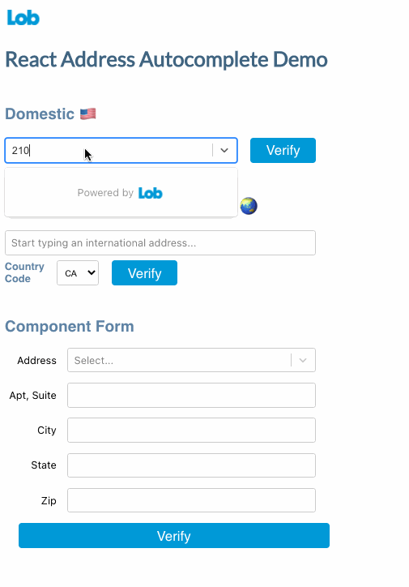
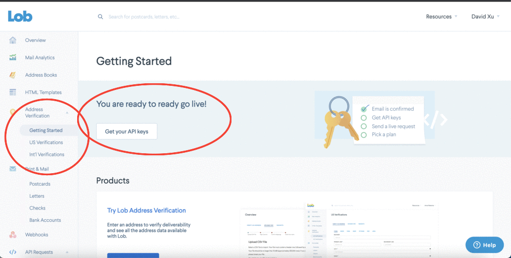
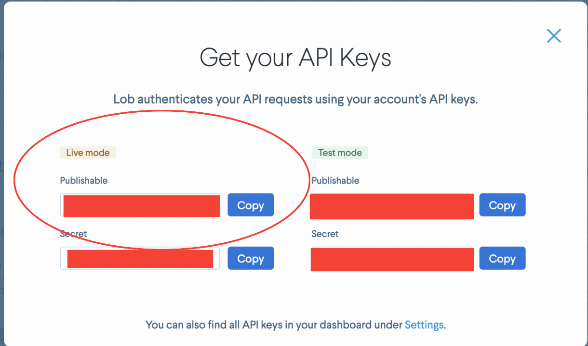

<svg id="Layer_1" data-name="Layer 1" xmlns="http://www.w3.org/2000/svg" viewBox="0 0 1259 602" height="60px"><path fill="#0099d7" d="M1063,141c-47.06,0-89,18.33-121,50.78V0H780V338.74C765,222.53,666.88,138,540,138c-137,0-242,101-242,232a235,235,0,0,0,7.7,60H164V0H0V585H307l14.54-112.68C359.94,550,441.74,602,540,602c127.75,0,225.08-83.62,240-200.41V585H930V540.27c31.8,37,77.27,56.73,133,56.73,103,0,196-109,196-228C1259,239,1175,141,1063,141ZM540,450c-45,0-81-36-81-80s36-80,81-80c46,0,81,35,81,80S585,450,540,450Zm475-1c-46,0-83-36-83-80a82.8,82.8,0,0,1,82.6-83h.4c47,0,85,37,85,83C1100,413,1062,449,1015,449Z"/></svg>

# Lob React Address Autocomplete

[](https://www.npmjs.com/package/@lob/react-address-autocomplete) []()
[](https://github.com/mui-org/material-ui/blob/master/LICENSE)

**Version 2 is here!**
Our latest version of address autocomplete uses the latest changes from [React 18](https://reactjs.org/blog/2022/03/29/react-v18.html). If you're using earlier version of react, please install version 1 package: `@lob/react-address-autocomplete@previous`

## Features

 This is a very lightweight component that uses the Lob Autocomplete API in order to simplify the process of adding in a search autocomplete bar or form. Check out the Autocomplete API for more configuration options on [Postman](https://www.postman.com/lobteam/workspace/lob-public-workspace/overview) or [Lob Documentation](https://docs.lob.com/).

 As always if this front end component doesn't suit your bootstrapped needs, feel free to check out the aformentioned links above to have more control over the look and feel of your address autocomplete and verification needs :)

## Install

```bash
npm install --save @lob/react-address-autocomplete
```

## Demo



## Address Autocomplete Search Bar Demo Code 

```jsx
import React, { useState } from 'react'

import { Autocomplete } from '@lob/react-address-autocomplete'

const App = () => {
  const [selectedResult, setSelectedResult] = useState({})
  const handleSelect = (selected) => {
    setSelectedResult(selected)
  }

  return (
    <Autocomplete
      apiKey="YOUR_API_KEY_HERE"
      onSelection={handleSelect}
      delaySearch={true}
    />
  )
}
```

## Address Autocomplete Form Demo Code 

```jsx
import React, { useState } from 'react';
import { AddressForm, verify } from '@lob/react-address-autocomplete'

const API_KEY = 'YOUR API KEY HERE'

const AddressFormDemo = () => {
  const [address, setAddress] = useState({})

  const handleFieldChange = (payload) => {
    console.log(`${payload.event.target.id} Field Change`, payload)
    setAddress(payload.address)
  }

  const handleSelect = (selection) => {
    console.log('Address Selection', selection)
    setAddress(selection.value)
  }

  const handleSubmit = () => {
    verify(API_KEY, address).then((verificationResult) => {
      console.log('Verification Results', verificationResult)
    })
  }

  return (
    <div className="demoContainer">
      <h2>Address Form</h2>
      <AddressForm
        apiKey={API_KEY}
        onSelection={handleSelect}
        onFieldChange={handleFieldChange}
      />
      <button
        onClick={handleSubmit}
        style={{ width: '100%' }}
      >
        Submit
      </button>
    </div>
  );
};

export default AddressFormDemo;
```


## Getting API Keys

Head to [Lob.com](https://www.lob.com/) and create your account. Head to the dashboard and click on Address Verification Getting Started to find your API keys. It's reccomended to use your publishable Live key for front end components. Likely you'll see an error mentioning that there is no verified payment method on hand. Unfortunately due to security reasons, we need a verified payment method on hand. Lob Autocomplete has free unlimited domestic requests so you don't have to worry about any credit card charges for requests about US addresses, however International autocomplete requests will be charged unfortunately. 





## Quick Usage

### apiKey

Just plug in the API key you grabbed earlier to the `apiKey` prop.

### Handling the Selection process

The `onSelect` prop is callback function that fires whenever an autocomplete suggestion has been selected. It passes in a location object with the following schema:

```json
{
   "value": {
      "primary_line": "185 BAYSIDE VILLAGE PL",
      "city": "SAN FRANCISCO",
      "state": "CA",
      "zip_code": "94107"
   },
   "label": "185 BAYSIDE VILLAGE PL SAN FRANCISCO CA 94107"
}
```

### Debounced Search requests

While Lob doesn't charge for requests, you can still set `delaySearch` to true which delays an API call until a user finishes typing in order to reduce API load. Additionally you can set `debounceValue` to control how long to wait between calls in milliseconds. This is 100% optional and everything will be functional without this on. 

[Click here for more details about the props for each component](https://github.com/lob/react-address-autocomplete/wiki/React-Address-Autocomplete-Component-Props)


## Release Logs
[View release notes from previous versions](https://github.com/lob/react-address-autocomplete/releases)

## License

MIT © [lob](https://github.com/lob)
